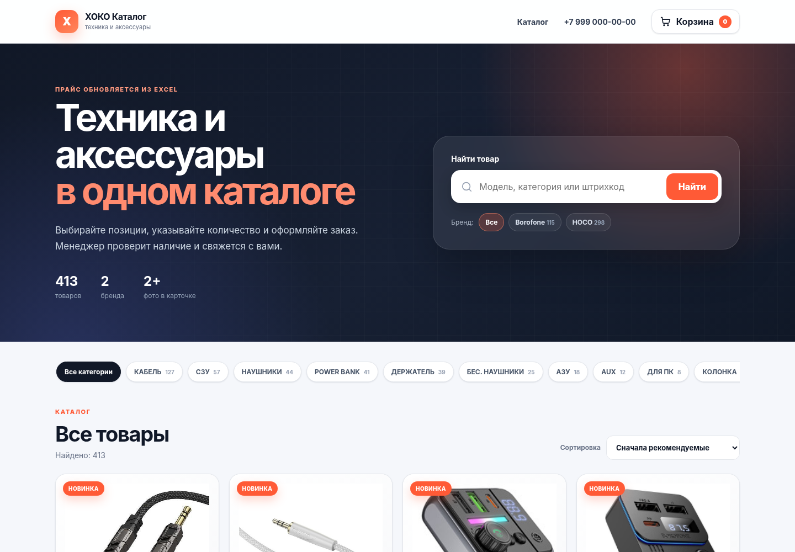

# ХОКО Каталог — каталог, корзина и заказы из XLSX



Готовое небольшое приложение для публикации прайсов HOCO, Borofone и других поставщиков. Оно читает `.xlsx`, извлекает **встроенные изображения**, связывает их с товарными строками и обновляет каталог по штрихкоду.

GitHub-версия намеренно поставляется **без базы, заказов, прайс-листов и извлечённых фотографий**. После первого запуска база создаётся автоматически. Загрузите свой `.xlsx` в админке — товары и встроенные изображения будут извлечены и добавлены в каталог автоматически.

## Технологии

- FastAPI и Uvicorn;
- SQLite без отдельного сервера базы данных;
- Jinja2, HTML/CSS и JavaScript без тяжёлого фронтенд-фреймворка;
- собственный OOXML-импортёр для картинок, встроенных в XLSX;
- Docker Compose для локального запуска;
- Caddy для домена и HTTPS на VPS.

## Что уже работает

- адаптивный каталог для телефона и компьютера;
- поиск по модели, категории и штрихкоду;
- фильтры по бренду и категории;
- карточка товара с галереей фотографий;
- количество прямо на карточке товара: кнопки − / + и ручной ввод числа;
- корзина, ручной ввод количества и автоматический пересчёт;
- оформление заказа с контактами, доставкой и комментарием;
- страница Политики обработки персональных данных и обязательное согласие при оформлении;
- фиксация версии политики и времени согласия в заказе;
- серверная проверка товаров и цен перед созданием заказа;
- админка с заказами и статусами;
- ручная правка цены и видимости товара;
- одновременная загрузка до 10 XLSX-прайсов;
- обновление без дублей по штрихкоду;
- опциональное скрытие товаров, исчезнувших из нового прайса;
- коэффициент наценки при импорте;
- история импортов и CSV-выгрузка заказов;
- уведомление о новом заказе в Telegram.

## Самый простой запуск

### macOS

1. Установите и запустите Docker Desktop.
2. Распакуйте проект.
3. Дважды нажмите `start.command`.
4. Откройте `http://localhost:8000`.
5. Админка: `http://localhost:8000/admin`.

### Windows — без Docker

1. Установите Python 3.12 или новее x64. При установке включите `Add Python to PATH`.
2. Распакуйте проект.
3. Запустите `start-local.bat`.
4. При первом запуске автоматически создастся `.venv` и установятся зависимости.
5. Откройте `http://localhost:8000`. Админка: `http://localhost:8000/admin`.

Docker для этого режима не нужен. Файл `start.bat` оставлен только как альтернативный Docker-запуск.

### Через терминал

```bash
cp .env.example .env
docker compose up --build
```

Пароль админки по умолчанию: `change-me-now`. **До размещения в интернете обязательно измените его**, а также `SECRET_KEY` в `.env`.

## Как обновлять каталог

1. Откройте `/admin`.
2. В блоке «Загрузить прайсы XLSX» выберите один или несколько файлов.
3. Укажите коэффициент цены:
   - `1.0` — показать цену из Excel;
   - `1.25` — прибавить 25%;
   - `1.5` — прибавить 50%.
4. При необходимости включите «Скрывать отсутствующие товары» — только при загрузке одного полного прайса.
5. Нажмите «Импортировать и обновить каталог».

Импортёр ищет строку заголовков автоматически. Поддерживаются распространённые названия колонок: `Модель`, `Цвет`, `Штрихкод`, `Шт. в кор.`, `Цена`, `Описание`, `Комментарий`. Если заголовок первой колонки пустой, как в исходном файле HOCO, она считается категорией.

Фотографии не обязаны быть ссылками: изображения, вставленные прямо в ячейки/строки Excel, извлекаются из внутренней структуры XLSX. Для обновления и защиты от дублей используется штрихкод. Одинаковые файлы изображений хранятся один раз по SHA-256.


## Как импортируются фотографии из XLSX

Импортёр не требует ручных URL картинок. `.xlsx` технически является ZIP-контейнером OOXML. Приложение читает внутренние `xl/drawings/*`, связи drawing -> media и файлы `xl/media/*`, определяет строку/колонку, к которой привязано изображение, и связывает его с товаром той же строки.

Поддерживаются обычные встроенные изображения, сохранённые как `oneCellAnchor`/`twoCellAnchor`, включая PNG, JPEG, GIF и WebP. Для исходного формата прайсов HOCO/Borofone этот механизм уже проверен. Изображения сохраняются с именем по SHA-256, поэтому одинаковая картинка не копируется повторно.

Если поставщик использует необычный формат (например, внешние ссылки, формулу `IMAGE()` или новый тип «картинка в ячейке» без drawing-anchor), такой файл может потребовать отдельного адаптера.

## Заказы

Клиент добавляет товары в корзину и отправляет заявку. Заказ сохраняется в SQLite и появляется в админке. На стороне сервера цена всегда берётся из актуальной базы, поэтому изменение суммы через инструменты браузера не повлияет на заказ.

Доступные статусы:

- Новый;
- Подтверждён;
- Собирается;
- Готов;
- Завершён;
- Отменён.

Текущая версия не списывает деньги с карты: она оформляет заказ с оплатой после подтверждения или при получении. Для интернет-эквайринга понадобятся договор и ключи конкретного провайдера.


## Персональные данные

Страница политики доступна по адресу `/privacy` и всегда есть в подвале сайта. На форме оформления заказа пользователь должен отдельно отметить согласие на обработку персональных данных. Без этого сервер заказ не создаст. В заказ сохраняются факт согласия, версия политики и время согласия; эти сведения также видны в админке и CSV-выгрузке.

Перед публикацией заполните в `.env` реальные данные оператора:

```env
LEGAL_OPERATOR_NAME=ИП Иванов Иван Иванович
LEGAL_OPERATOR_ADDRESS=г. Москва, ...
LEGAL_OPERATOR_EMAIL=privacy@example.ru
PRIVACY_POLICY_VERSION=2026-09-02
```

Если существенно меняете текст `templates/privacy.html`, одновременно меняйте `PRIVACY_POLICY_VERSION`, чтобы новые заказы фиксировали новую редакцию. Текст в проекте — базовый технический шаблон и должен быть проверен под конкретное юрлицо/ИП, способы оплаты, доставки, хостинг и подключённые внешние сервисы.

## Telegram-уведомления

В `.env` заполните:

```env
TELEGRAM_BOT_TOKEN=123456:ABCDEF
TELEGRAM_CHAT_ID=123456789
```

После этого бот будет отправлять менеджеру номер заказа, контакты, товары и итоговую сумму. Ошибка Telegram не мешает созданию заказа.

## Размещение на VPS с доменом и HTTPS

1. Установите Docker и Docker Compose на VPS.
2. Скопируйте проект на сервер.
3. Создайте `.env` и добавьте строку `DOMAIN=shop.example.com`.
4. Скопируйте `Caddyfile.example` в `Caddyfile`.
5. Направьте DNS-запись домена на IP сервера.
6. Запустите:

```bash
docker compose -f docker-compose.prod.yml up -d --build
```

Caddy выпустит и обновит HTTPS-сертификат автоматически. После включения HTTPS установите `SESSION_COOKIE_SECURE=true`.

## Импорт через командную строку

```bash
python scripts/import_price.py "/путь/к/прайсу.xlsx" --multiplier 1.25
```

Скрыть отсутствующие позиции:

```bash
python scripts/import_price.py "/путь/к/прайсу.xlsx" --deactivate-missing
```

## Хранение данных

- `data/shop.db` — товары, заказы и история импортов;
- `data/media/` — извлечённые изображения;
- `data/imports/` — архив загруженных через админку прайсов.

Эти runtime-данные исключены из Git через `.gitignore`. На production перед обновлением сервера достаточно сохранить каталог `data`.

## Важные производственные настройки

- замените пароль и секретный ключ;
- используйте HTTPS;
- делайте резервную копию `data`;
- не публикуйте `.env` в Git;
- укажите реальные контакты магазина;
- перед приёмом платежей добавьте юридические документы и политику обработки персональных данных.

## Проверка

Результаты сквозных тестов находятся в [`docs/TEST_REPORT.md`](docs/TEST_REPORT.md).

## Запуск без Docker (Windows)

Docker для локальной работы не обязателен. Установите Python 3.12+ и запустите `start-local.bat`. Скрипт сам создаст `.venv`, установит зависимости из `requirements.txt`, создаст `.env` при первом запуске и запустит сервер на `http://localhost:8000`. Для остановки сервера нажмите `Ctrl+C`.

Перед публикацией измените `ADMIN_PASSWORD` и `SECRET_KEY` в `.env`.


## GitHub

Инструкция по безопасной публикации репозитория: [`GITHUB_UPLOAD.md`](GITHUB_UPLOAD.md).
